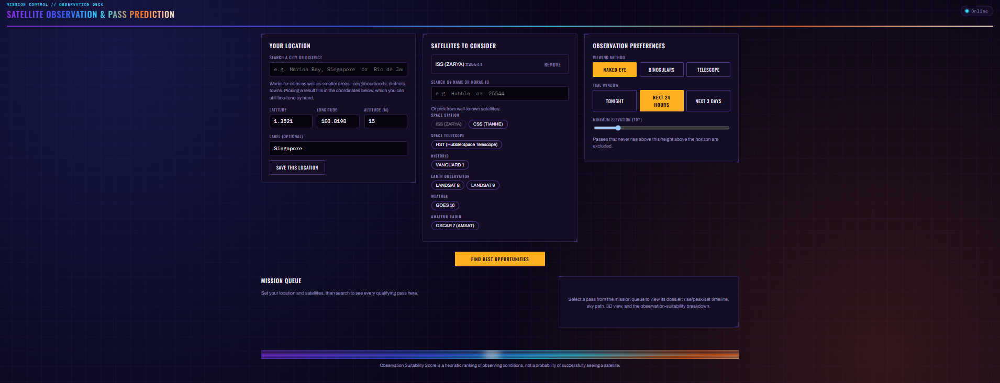
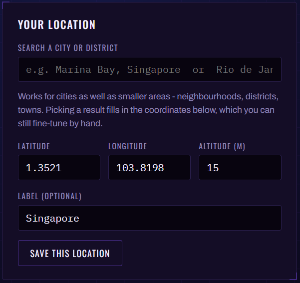
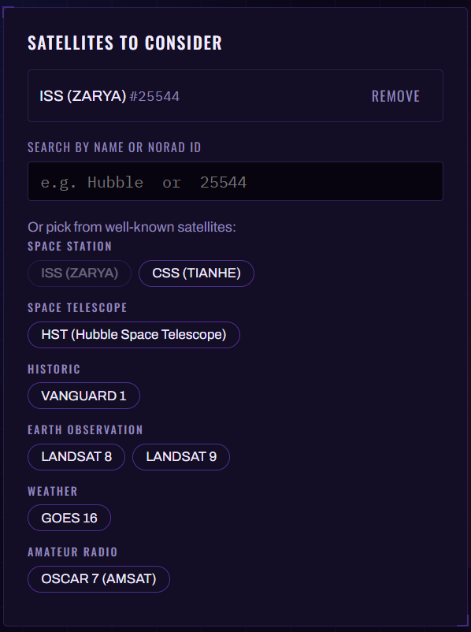
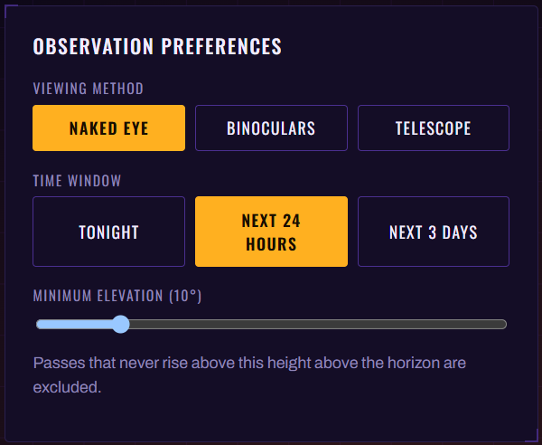
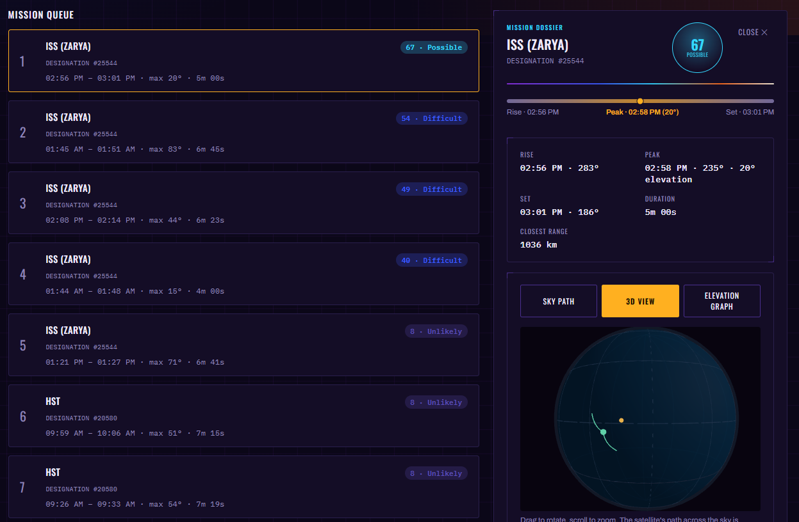
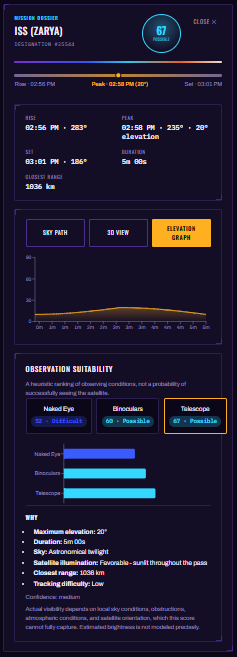
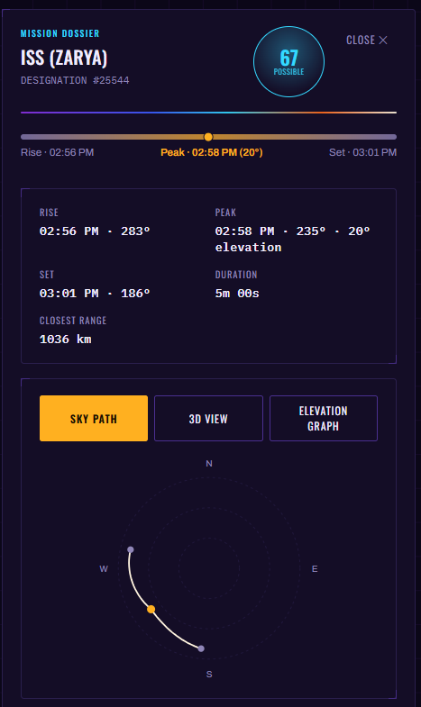
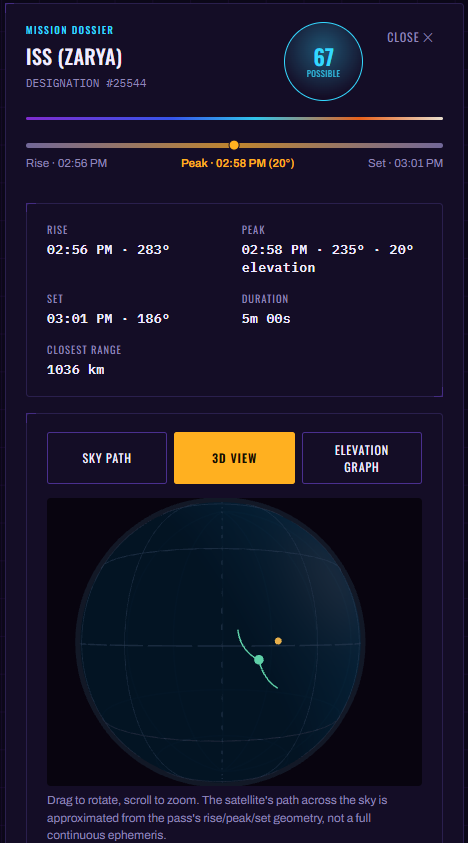
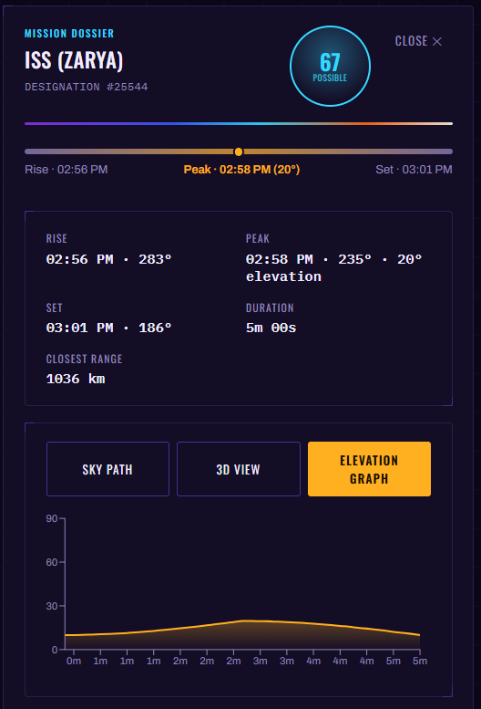
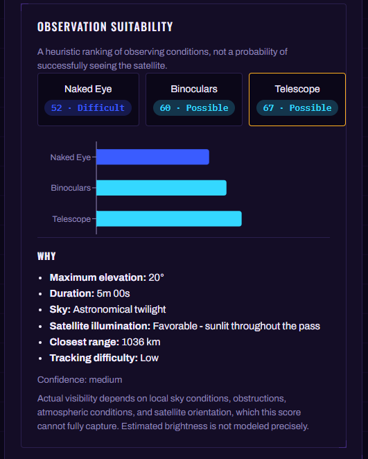

# Satellite Observation & Pass Prediction System

A full-stack application that uses **real satellite orbital data** to
predict when a satellite will be visible from a given place on Earth,
and how good an opportunity that viewing will actually be - for the
naked eye, binoculars, and telescopes separately.

It answers a question anyone can understand ("when can I go outside and
see the ISS tonight?") using genuine orbital mechanics (SGP4
propagation, real ephemeris-grade coordinate transforms, real sun/shadow
geometry) rather than a lookup table or a guess.

Web Link not public yet, but can be set up locally using INTRUCTIONS.md.

---

## Table of contents

1. [What it does](#1-what-it-does)
2. [Using the site](#2-using-the-site)
3. [How it works](#3-how-it-works)
4. [The API](#4-the-api)
5. [Database](#5-database)
6. [Tech stack](#6-tech-stack)
7. [Repository structure](#7-repository-structure)
8. [Running it yourself](#8-running-it-yourself)
9. [Limitations](#9-limitations)

---

## 1. What it does

In plain terms: tell it where you are and which satellite you're
interested in (or pick from a short list of well-known ones, like the
ISS or the Hubble Space Telescope), and it tells you exactly when that
satellite will next be visible overhead, from which direction, how
high in the sky it will get, how long it will stay up, and how good a
viewing opportunity that actually is - with a plain-English explanation
of *why*, not just a number.

More precisely, for a given observer location and satellite, the system:

1. Fetches that satellite's current real orbital data from
   [CelesTrak](https://celestrak.org).
2. Propagates its orbit forward in time using the same SGP4 model real
   satellite-tracking software uses.
3. Works out, for any moment, where the satellite is relative to the
   observer - compass direction (azimuth) and height above the horizon
   (elevation).
4. Searches a time window for complete passes: the satellite rising
   above the horizon, reaching a peak elevation, and setting again.
5. For each pass, works out whether the sky is actually dark enough,
   and whether the satellite itself is lit by the sun or hidden in
   Earth's shadow - both of which matter as much as geometry for
   whether you'd actually see anything.
6. Combines all of that into an **Observation Suitability Score**
   (0-100) and a plain classification (Excellent / Very Good / Possible
   / Difficult / Unlikely) for each of naked eye, binoculars, and
   telescope - because a great telescope pass and a great naked-eye
   pass aren't the same thing (a fast, close pass is easy to see but
   hard to track through an eyepiece).
7. Ranks every qualifying pass across however many satellites you're
   considering, so you can find the single best opportunity rather
   than checking one satellite at a time.

**This is a heuristic ranking, not a probability of successfully seeing
anything.** It doesn't know about clouds, haze, light pollution, or
what's physically blocking your horizon - see
[Limitations](#9-limitations).

## 2. Using the site

The whole app is one page - "mission control" - with everything you
need visible together rather than spread across separate screens:

- **Your location** - type a city or district ("Camden, London" works,
  so does just "Singapore") and pick a match, or enter
  latitude/longitude/altitude directly. Locations you save persist (if
  a database is configured) so you don't have to re-enter them.
- **Satellites to consider** - pick from a short curated list of
  well-known satellites (chips you can click), search any satellite by
  name, or add one directly by its NORAD catalog ID if you know it.
- **Observation preferences** - naked eye / binoculars / telescope,
  how far ahead to search (tonight / next 24 hours / next 3 days), and
  the minimum elevation you'd consider worth going outside for.
- **Mission queue** - click "Find best opportunities" and every
  qualifying pass across every satellite you added shows up here,
  ranked best first.
- **Mission dossier** - click any result to open its full detail
  alongside the queue: the rise/peak/set timeline, a sky-path diagram,
  an interactive 3D globe view, an elevation-over-time graph, and the
  full score breakdown with its explanation for each viewing method.

No satellite-tracking experience is assumed - the defaults (a
well-known city, the ISS, naked-eye viewing) are chosen so a first-time
visitor can click "Find best opportunities" immediately and see
something real.

### Screenshots

> Image slots below - drop files into `docs/screenshots/` using the
> filenames shown (or update the paths) and each will render in place.
> Roughly 1600px wide, PNG or JPG, works well for all of these.

**Mission control - full page**



The whole layout at a glance: the three control cards on top, the
mission queue and dossier below.

**The control cards**

| Your location | Satellites to consider | Observation preferences |
|---|---|---|
|  |  |  |

**Mission queue**



Every qualifying pass, ranked best first, with its classification badge.

**Mission dossier**

| Overview & timeline | Sky path | 3D view | Elevation graph |
|---|---|---|---|
|  |  |  |  |

**Observation suitability breakdown**



The score for each viewing method side by side, with the factors behind
the selected one.

## 3. How it works

### 3.1 Architecture

```
                         CelesTrak (real orbital data)
                                    │
                                    ▼
                  ┌─────────────────────────────────┐
                  │      FastAPI backend (Python)    │
                  │                                  │
                  │  orbital data ingestion & cache  │
                  │  SGP4 propagation                │
                  │  coordinate transforms            │
                  │  pass detection                   │
                  │  sun/shadow astronomy             │
                  │  visibility scoring                │
                  │  ranking                           │
                  └────────────────┬─────────────────┘
                                    │  REST / JSON
                                    ▼
                  ┌─────────────────────────────────┐
                  │  React + TypeScript frontend      │
                  │  (single-page "mission control")  │
                  └─────────────────┬─────────────────┘
                                    │
                                    ▼
                            PostgreSQL (optional)
             satellites, orbital elements, observers,
                  passes, visibility predictions
```

The backend is the *only* place any orbital-mechanics computation
happens - the browser never propagates an orbit or computes a score
itself. It just renders whatever the API returns. PostgreSQL is
optional: without it, the backend still fully computes passes and
rankings, it just can't persist satellite data across a restart or save
observer locations (see [Database](#5-database)).

### 3.2 Orbital data

`GET /api/satellites/{norad_id}` fetches a satellite's current orbital
elements from CelesTrak's GP (General Perturbations) data. This
actually takes two separate requests under the hood, because CelesTrak's
two relevant output formats carry different information: `FORMAT=JSON`
returns the individually-parsed orbital parameters (mean motion,
eccentricity, inclination, ...), and `FORMAT=2LE` returns the raw
two-line element (TLE) text that the propagation step below actually
needs. Both responses are validated before anything is trusted or
cached: required fields must be present, values must be physically
plausible (eccentricity between 0 and 1, inclination between 0° and
180°, etc.), and the TLE lines must have the correct prefix, length, and
checksum.

Results are cached (in PostgreSQL if configured, otherwise in memory)
for a configurable TTL - 6 hours by default, since CelesTrak's own data
only changes a few times a day and re-fetching more often just risks
being rate-limited for no benefit.

A curated list of well-known satellites (`GET /api/satellites/catalog`)
and a live name search against CelesTrak (`GET /api/satellites/search`)
make it possible to find a satellite without already knowing its NORAD
ID.

### 3.3 Orbital propagation (SGP4)

Given a satellite's orbital elements and a point in time, the
[`sgp4`](https://pypi.org/project/sgp4/) library - a mature,
widely-used implementation of the standard SGP4 model, not a
from-scratch reimplementation - computes the satellite's position and
velocity in an Earth-centered inertial reference frame (TEME). This has
been checked against the model's own official reference test vectors
and agrees to sub-millimeter precision.

That position is then converted into what actually matters to an
observer - azimuth, elevation, and range from a specific
latitude/longitude/altitude - using proper coordinate-frame
transformations (via [Astropy](https://www.astropy.org/)) rather than
hand-rolled trigonometry, correctly accounting for the time, the
observer's position, and Earth's rotation and orientation.

### 3.4 Pass detection

A "pass" is one continuous stretch of time a satellite spends above a
minimum elevation - it rises above the horizon, climbs to a peak
elevation, and sets again. Finding every pass in a time window works by
sampling elevation at a coarse regular interval, detecting where it
crosses the minimum-elevation threshold, then refining the exact
rise/set moments and the true peak elevation with targeted numerical
search rather than just using the coarse samples directly. Each pass
records its rise/peak/set times, azimuths, maximum elevation, duration,
and range.

### 3.5 Visibility & the Observation Suitability Score

Geometry alone (is it above the horizon?) doesn't tell you whether
you'd actually see anything. Two more things have to be true:

- **The sky has to be dark enough** - computed from the Sun's own
  altitude at the observer's location and time (civil / nautical /
  astronomical twilight, using the standard -6°/-12°/-18° boundaries).
- **The satellite itself has to be lit by the Sun**, not sitting in
  Earth's shadow - computed with a standard simplified cylindrical
  Earth-shadow model.

Darkness and illumination act as **multipliers** on the score, not just
inputs averaged in - a geometrically perfect pass that happens in
daylight, or while the satellite is eclipsed, correctly still scores
near zero, rather than getting an artificially decent score from
elevation and duration alone.

On top of that, each of the three viewing methods gets its own
subscore based on what actually matters for it:

- **Elevation, duration, and range** (closer and higher is better,
  longer passes are better, with a longer effective "reach" for
  binoculars and telescopes than the naked eye).
- **Tracking difficulty for telescopes specifically** - a satellite's
  apparent angular speed across the sky is estimated from its true
  orbital speed and its distance at closest approach, and a fast, close
  pass is penalized. This is deliberate: more magnification does not
  make a fast-moving target easier to keep in view, so a telescope does
  not automatically get the best score just because it can (in
  principle) resolve fainter or more distant objects.

The final result for each method is a **score** (0-100), a
**classification** (Excellent 90-100 / Very Good 75-89 / Possible 55-74
/ Difficult 35-54 / Unlikely 0-34 - the project's own defined bands, not
a universal astronomical standard), a **confidence level** (downgraded
for genuinely uncertain cases, like a pass with a mid-pass shadow
transition), and a list of the specific **factors** behind the score and
**limitations** worth knowing - so the site never shows a bare number
without an explanation.

### 3.6 Ranking

Given an observer and a set of satellites to consider, the ranking step
fetches each satellite's current data, finds its passes in the
requested window, scores every pass for the requested viewing method,
and returns them sorted best-first (with optional filters on minimum
score or elevation). A satellite that fails to fetch or validate is
skipped with a logged warning rather than failing the whole ranked
list - one bad or temporarily-unreachable satellite shouldn't take
down the rest of the results.

### 3.7 Frontend

A single-page React + TypeScript app (no client-side router - there's
only one page, so there's nothing to route between). The visual theme
("Ultraviolet") is a deliberate design choice - deep space black with a
saturated violet-to-orange spectral palette, styled after 1970s
scientific mission posters and false-color imaging - applied consistently
across the layout, typography, and the classification color scale
(cooler colors for weaker opportunities, hotter colors for stronger
ones).

The elevation graph, sky-path diagram, and 3D globe view all draw from
exactly three real, SGP4-derived points per pass (rise, peak, set); the
smooth curves connecting them are interpolated for display, not
re-derived orbital mechanics - see [Limitations](#9-limitations).

## 4. The API

Interactive, always-current documentation is at `/docs` (Swagger UI) and
`/redoc` on any running instance of the backend. Summary:

| Method & path | Purpose | Needs a database? |
|---|---|---|
| `GET /health` | Health check | no |
| `GET /api/satellites/catalog` | Curated list of well-known satellites | no |
| `GET /api/satellites/search?q=` | Search satellites by name (live, via CelesTrak) | no |
| `GET /api/satellites/{norad_id}` | Fetch one satellite's current orbital data | cache only |
| `GET /api/satellites` | List previously-fetched satellites | yes |
| `GET /api/geocode?q=` | Resolve a place name to coordinates | no |
| `POST /api/observers` | Save an observer location | yes |
| `GET /api/observers`, `GET /api/observers/{id}` | List / fetch saved locations | yes |
| `DELETE /api/observers/{id}` | Delete a saved location | yes |
| `POST /api/passes/predict` | Compute (and persist) passes for a satellite + observer + time window | yes |
| `GET /api/passes/next` | The single soonest pass, computed live | no |
| `GET /api/passes/search` | Search previously-predicted, stored passes | yes |
| `GET /api/passes/{id}`, `GET /api/passes/{id}/visibility` | Fetch a stored pass / its visibility scores | yes |
| `GET /api/observations/best` | Ranked opportunities across satellites, computed live | no |

The live/no-database endpoints (`/passes/next`, `/observations/best`)
deliberately don't persist anything - they're quick, side-effect-free
lookups, which is what a `GET` should be. `POST /api/passes/predict`
does persist, which is exactly why it needs a database and why it's a
`POST`: it creates a real, addressable resource with a database id.

## 5. Database

PostgreSQL is optional (see [Running it yourself](#8-running-it-yourself)
for local setup, and `DEPLOYMENT.md` for a real deployment). Five
tables:

| Table | Holds |
|---|---|
| `satellites` | Satellite identity: NORAD ID, name, international designator |
| `orbital_elements` | Every fetched set of orbital elements (one row per fetch, not overwritten - see below), linked to a satellite |
| `observers` | Saved locations: name, latitude, longitude, altitude |
| `passes` | A computed pass: rise/peak/set times, azimuths, elevation, duration, range, linked to a satellite and an observer |
| `visibility_predictions` | One row per viewing method per pass: score, classification, confidence, and the factors/limitations behind it (as JSON) |

`orbital_elements` keeps every fetch rather than overwriting the
previous one - each row is cheap, and it's a genuine historical record
of how a satellite's known orbit changed over time. Deleting an
observer cascades to delete its passes and their visibility predictions.

Without a database configured, the backend falls back to an in-memory
cache for satellite data (lost on restart) and the endpoints that
require persistence (saving locations, `/passes/predict`, listing
history) return a clear `503` rather than silently failing.

## 6. Tech stack

| Layer | Technology |
|---|---|
| Frontend | React, TypeScript, Vite, Three.js (3D globe), Recharts (charts) |
| Backend | Python, FastAPI, Pydantic |
| Orbital computation | [`sgp4`](https://pypi.org/project/sgp4/), [Astropy](https://www.astropy.org/), NumPy |
| Database | PostgreSQL, SQLAlchemy, Alembic |
| Orbital data source | [CelesTrak](https://celestrak.org) |
| Place search | OpenStreetMap / Nominatim |
| CI | GitHub Actions (see `.github/workflows/ci.yml`) |
| Hosting (see `DEPLOYMENT.md`) | Cloudflare Pages (frontend), Render (backend), Neon (database) |

## 7. Repository structure

```
satellite-obs-system/
├── .github/workflows/ci.yml   # GitHub Actions: lint, type-check, test, build
├── render.yaml                 # Render Blueprint (backend deployment as code)
├── docker-compose.yml          # local Postgres for development (optional)
├── INSTRUCTIONS.md             # full local setup, running, and troubleshooting guide
├── DEPLOYMENT.md                # step-by-step deployment guide
├── LIMITATIONS.md                # consolidated known limitations
├── backend/
│   ├── alembic/                # database migrations
│   └── app/
│       ├── api/                # route definitions + dependency wiring (deps.py)
│       ├── core/                # config, logging, propagation, coordinates,
│       │                        # passes, visibility (astronomy), scoring, ranking
│       ├── data/                # CelesTrak client, geocoding client, TLE/validation,
│       │                        # in-memory cache, Postgres-backed cache, satellite catalog
│       ├── db/                   # SQLAlchemy engine/session, base, repositories/
│       ├── models/                # SQLAlchemy ORM models
│       ├── schemas/                # Pydantic request/response schemas
│       ├── services/               # business logic (satellite, search, geocoding, ranking)
│       └── main.py                  # FastAPI app entrypoint
│   └── tests/
└── frontend/
    └── src/
        ├── api/           # typed API client
        ├── components/    # LocationForm, SatellitePicker, PassDossier, charts, etc.
        ├── hooks/
        ├── pages/         # Dashboard - the single page
        ├── types/
        └── utils/
```

## 8. Running it yourself

**Full step-by-step setup** - exact commands for every terminal you
need, in order, with expected output and troubleshooting - is in
[`INSTRUCTIONS.md`](./INSTRUCTIONS.md). Short version:

```bash
# Database (optional - see INSTRUCTIONS.md if you'd rather skip it)
docker compose up -d

# Backend
cd backend
python -m venv .venv && source .venv/bin/activate   # Windows: .venv\Scripts\Activate.ps1
pip install -r requirements.txt
cp .env.example .env        # then edit DATABASE_URL if you started the database
alembic upgrade head        # only if DATABASE_URL is set
uvicorn app.main:app --reload

# Frontend (separate terminal)
cd frontend
cp .env.example .env.local
npm install
npm run dev
```

Frontend: `http://localhost:5173`. API + interactive docs:
`http://localhost:8000/docs`. Supported versions: Python 3.8-3.12 (3.11
recommended), Node.js 18+ (20/22 LTS recommended).

Testing: `pytest` (backend, from `backend/`) and `npm test` (frontend,
from `frontend/`) - see `INSTRUCTIONS.md` section 8 for the full
picture, including the database caveat for the backend suite.

Deploying for real (Cloudflare Pages + Render + Neon, $0/month on free
tiers): [`DEPLOYMENT.md`](./DEPLOYMENT.md).

## 9. Limitations

The short version - full list in [`LIMITATIONS.md`](./LIMITATIONS.md):

- The Observation Suitability Score is a **heuristic**, not a
  probability - it doesn't know about clouds, haze, light pollution, or
  physical obstructions at your specific location.
- Satellite brightness isn't modeled beyond the illumination/range/
  darkness factors already described - precise visual-magnitude
  prediction is out of scope.
- Illumination uses a simplified cylindrical Earth-shadow model (no
  penumbra, spherical rather than oblate Earth) - a standard
  simplification, not a precise eclipse calculation.
- Charts and the 3D globe interpolate smoothly between the three real
  computed points per pass (rise/peak/set) rather than showing a
  continuous ephemeris.
- Satellite discovery is a curated list plus live name/ID search - there
  is no bulk "browse everything CelesTrak tracks" catalog.
- No authentication - not in scope for this project.
